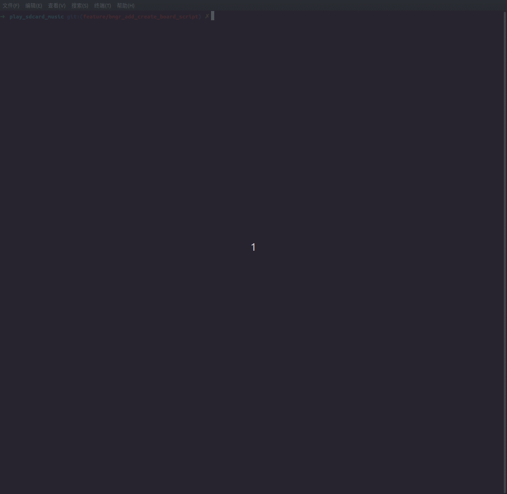

# 如何创建自定义板子

## 支持的板子路径

ESP Board Manager 能够模块化自定义板子，支持将自定义板子文件放在以下三种不同的路径，为不同的部署场景提供灵活性：

1. **主板级目录**: 随组件提供的内置板子，路径如 `esp_board_manager/boards`
2. **用户项目组件**: 在项目组件中定义的自定义板子，路径如 `{PROJECT_ROOT}/components/board_name`，可参考: [`esp_board_manager/test_apps/components/test_board_e/`](../test_apps/components/test_board_e/)
3. **自定义路径**: 自定义位置的外部板子定义，如 [`esp_board_manager/test_apps/test_single_board`](../test_apps/test_single_board/)，执行命令时需要通过 `-c` 参数指定路径来设置自定义路径 `idf.py bmgr -c test_single_board -l`（旧命令：`idf.py gen-bmgr-config -c test_single_board -l`）

仓库内提供了一个 **常用设备的配置模板文档**，便于迅速查看及获取常用设备的 **yaml 配置文件**：[常用配置模板](./board_config_template_cn.md)

> **注意：** 如果使用从组件仓库自动下载 ESP Board Manager 组件，不建议直接在主板级目录下直接创建自定义板子，避免清理组件时误删除自定义板子配置

## 创建新板子

### 1. **创建板子目录**

- 推荐将板子目录放置在项目的 `components` 文件下 `{PROJECT_ROOT}/components/XXXX`，

   ```bash
   mkdir components/<board_name>
   cd components/<board_name>
   ```

### 2. **创建必需文件**

创建新板子目前支持三种方式：

#### 2.1 **基于已有配置修改**

- 用户可以从主板级目录复制相似的板子文件到项目目录，然后**根据实际使用的板子进行修改**（推荐），可以参考以下内容来验证 [验证和使用新板子](#验证和使用新板子)

#### 2.2 **使用脚本创建**

- 使用 ESP Board Manager 提供的脚本自动创建板子，执行脚本可以根据所选择的外设和设备，**自动查找并复制** 所需配置，省去手动从对应文件夹复制配置信息的步骤，使用方法如下：

```bash
# 在默认路径创建板子(默认路径为 {PROJECT_ROOT}/components/<board_name>):
idf.py bmgr -n <board_name>

# 在自定义路径创建板子:
idf.py bmgr -n path/to/board/<board_name>
```

执行脚本后需要根据提示依次选择 **芯片、设备及外设**，脚本会自动检查设备对外设的依赖关系，如果缺少外设，脚本会提示您进行补充，直到所有依赖都得到满足

> **注意：**
> - 进行后续操作前，需要手动 **检查并修改 `board_devices.yaml` 和 `board_peripherals.yaml` 配置文件以满足实际板子的需求**，重点关注有 `[IO]` 和 `[TO_BE_CONFIRMED]` 关键字的配置项
> - 请检查设备及外设的名称，确保没有同名的设备或外设
> - 只有芯片能够支持的设备和外设才会出现在脚本的选项中
> - **重要：设备通过命名来查找依赖的外设**，请确保设备依赖的外设均被添加到 `board_peripherals.yaml` 中，并且在 `board_devices.yaml` 的设备配置里所填写的外设 `name` 与 `board_peripherals.yaml` 中对应的 `name` 完全一致，并且外设命名**必须以类型作为开头**
>
> 例如
> ```yaml
> # board_devices.yaml
>  - name: led_green
>    type: gpio_ctrl
>    config:
>      ...
>    peripherals:
>      - name: gpio_led_g
>
> # board_peripherals.yaml
>  - name: gpio_led_g
>    type: gpio
>    config:
>      ...
> ```

**使用方法演示**


#### 2.3 **手动创建文件**

- 运行以下脚本，手动创建板子所需文件。

   ```bash
   touch board_peripherals.yaml
   touch board_devices.yaml
   touch board_info.yaml
   touch sdkconfig.defaults.board  # 可选：板子特定的 SDK 配置默认值
   ```

> **注意：**
>
> - 如果选择手动创建板子文件，或是复制其他板子的配置文件进行修改，需要注意，开发板名称以存放配置文件的文件夹名称为主，请确保文件夹名称与 `board_info.yaml` 中的 `board` 字段一致。
>
> - **重要：板子命名必须符合规范**，仅允许包含 **字母（a-z, A-Z）、数字（0-9）和下划线（_）**。不支持中划线（-）或其他特殊字符，如果命名不符合规范，这个板子将不可用。
>
> - 每个开发板都需要至少包含 `board_info.yaml`、`board_devices.yaml` 和 `board_peripherals.yaml` 三个文件，脚本在搜索可用开发板时会以这三个文件是否存在作为判断依据。
>
> - 每种方法都依赖于设备和外设 YAML 文件中的配置，这些 YAML 文件；尽量使用了原始驱动参数，包括：
>
>     - 支持哪些配置字段
>     - 有效的枚举值
>     - 允许的参数范围
>
>     换句话说，YAML 配置的设计旨在尽可能匹配适配底层驱动 API，可以复用现有的驱动知识。
>
>     有关确切的定义和支持的选项，请参考：
>
>     - `esp_board_manager/devices/xxx/xxx.yaml`
>     - `esp_board_manager/peripherals/xxx/xxx.yaml`

### 3. **`version` 字段：解析契约（Schema Version）**

**核心含义：`version` 声明的是当前这份 YAML 所遵循的「解析语法规范版本」**，也就是生成器与用户配置之间的一份**解析契约**。当 Board Manager 未来对目录结构或字段语义做不兼容调整时，可依据该字段区分新旧语法，并对旧文件做迁移或兼容处理，避免工程静默损坏。

**1. 板级契约（`board_info.yaml`）**
- 表示整块板子配置所采用的 **board 描述规范代数**（目录布局、`board_info` 字段含义等）。
- **长远用途**：大规模重构 board 层 schema 时，生成器可据此刻度选择解析分支，实现新旧配置的过渡。

**2. 设备 / 外设（仅支持下列写法）**
在 **`board_peripherals.yaml`**、**`board_devices.yaml`** 中，**仅**在 `peripherals` / `devices` **列表的每一项**里使用 `version`，且与 **`name`、`type` 同级**（同一映射下的并列字段），例如：

```yaml
peripherals:
  - name: xxx
    type: adc
    version: 1.0.0   # 可选；条目级，与 name/type 同级

devices:
  - name: xxx
    type: gpio_ctrl
    version: 1.0.0   # 同上
```

**代数约定（非永久锁死）：** 本仓库当前这一代板级 YAML 的 schema **代号是 `1.0.0`**——表示「与当前解析器/字段语义一致的那一代」。**不写 `version` 即表示使用当前这一代**（与写 `1.0.0` 等价）。**`version: default`（不区分大小写）** 与省略或写 `1.0.0` 等价，生成元数据里会 **解析为当前代号 `1.0.0`**。日后若有 **breaking 变更**，会通过 **新的代号**（如 `2.0.0`）区分；新版本工具链会同时识别新老代号。若写了 **本发布尚不认识的代号**，生成时会 **警告**（请核对 Board Manager 版本或改为当前代号 / `default` / 省略字段）。

**3. 勿与下列「version」混淆**
- `board_devices.yaml` 里 **`dependencies`** 下各组件的 `version`（如 `"*"`、`~1.5`）属于 **ESP-IDF 组件管理器**的依赖版本约束，**不是**上述「YAML 解析契约」。

### 4. **配置文件结构**

**板子信息**
   ```yaml
   # board_info.yaml
   board: <board_name>
   chip: <chip_type>
   version: <version>
   description: "<board description>"
   manufacturer: "<manufacturer_name>"
   ```

**外设配置**
   - 根据 `boards` 中相似的外设 YML 文件进行参考和修改
   - 基于 `peripherals` 下支持的外设 YML 文件进行配置
   每个外设的基本结构如下：
   ```yaml
   # board_peripherals.yaml
   peripherals:
     - name: <peripheral_name>
       type: <peripheral_type>
       version: <version>
       role: <peripheral_role>
       config:
         # 外设特定配置
   ```

**设备配置**
   - 根据 `boards` 中相似的设备 YML 文件进行参考和修改
   - 基于 `devices` 下支持的设备 YML 文件进行配置
   每个设备的基本结构如下：
   ```yaml
   # board_devices.yaml
   devices:
     - name: <device_name>
       type: <device_type>
       version: <version>
       sub_type: <sub_type>   # 可选：子设备类型字符串，每个设备可能有自己的子类型或没有
       init_skip: false  # 可选：跳过自动初始化（默认：false）
       dependencies:     # 可选，定义组件依赖关系
         espressif/gmf_core:
            version: '*'  # 使用来自 espressif 组件注册表的版本
            override_path: ${BOARD_PATH}/gmf_core
            # 可选：允许您使用本地组件而不是从组件注册表下载的版本
            # 您可以指定：
            #   - 绝对路径，或
            #   - 在 ${BOARD_PATH} 下的相对路径以便于管理
       depends_on: <device_name>  # 可选: 用于声明当前设备依赖的其他设备
       config:
         # 设备特定配置
         sub_config:      # 可选：如果存在 sub_type，则提供子配置
         # 子类型特定配置
       peripherals:
         - name: <peripheral_name>
   ```

> **⚙️ 关于 `dependencies` 使用说明**
>
> - `board_devices.yaml` 中的 `dependencies` 字段允许您为每个设备指定组件依赖关系。这对于需要自定义或本地组件版本的板子特别有用。
> - 这些依赖关系将被复制到 `gen_bmgr_codes` 文件夹中的 `idf_component.yml` 文件中。如果存在相同名称的依赖关系，根据 YAML 顺序，只保留最后一个。
> - 该字段支持所有组件注册表功能，包括 `override_path` 和 `path` 选项。更多详情请参考[组件依赖](https://docs.espressif.com/projects/idf-component-manager/en/latest/reference/manifest_file.html#component-dependencies)。
> - 使用相对路径作为本地路径时，请注意它们是相对于 `gen_bmgr_codes` 目录的。如果用户指定本地路径在板子目录，可使用 `${BOARD_PATH}` 来简化路径。参考示例：`./test_apps/test_custom_boards/my_boards/test_board1`。
>
> **⚙️ `${BOARD_PATH}` 变量：**
> - `${BOARD_PATH}` 是一个特殊变量，始终指向当前板子定义的根目录（即包含您的 `board_devices.yaml` 的文件夹）。
> - 在 `override_path` 或 `path` 字段中指定本地或板子特定组件路径时，始终使用 `${BOARD_PATH}`。更多详情请参考[本地目录依赖](https://docs.espressif.com/projects/idf-component-manager/en/latest/reference/manifest_file.html#local-directory-dependencies)。
> - ❌ **错误**：`{{BOARD_PATH}}` 或 `$BOARD_PATH`

### 设备依赖（`depends_on`）

可选字段，类型为字符串或字符串列表，用于声明当前设备依赖的其他设备。Board Manager 会**先**初始化依赖项、**最后**才反初始化它们；只要还有任意活跃设备依赖某项，该项就会保持初始化状态不被释放。

```yaml
devices:
  - name: io_expander_aw9523
    type: gpio_expander
    # ... config ...

  - name: display_lcd
    type: display_lcd
    sub_type: i80
    depends_on:
      - io_expander_aw9523    # LCD 初始化前先初始化 IO 扩展芯片；LCD 反初始化后再释放它
    # ... config ...

  - name: button_power
    type: button
    sub_type: custom
    depends_on: io_expander_aw9523    # 单个依赖可以直接用字符串
```

语义：

- 在 `esp_board_manager_init()`（以及 `esp_board_device_init(name)`）时，`depends_on` 中的每一项会被先初始化。若任一依赖初始化失败，已部分初始化的依赖链会自动回滚。
- 反初始化阶段，只要还有其他活跃设备在 `depends_on` 中声明了某设备，该设备就不能被反初始化，运行时会返回 `ESP_BOARD_ERR_DEVICE_DEP_IN_USE`。
- `depends_on` 中存在循环依赖时，parser 会在生成阶段检测并报错。

### 5. **板子特定的 SDK 配置（可选）**

`sdkconfig.defaults.board` 文件用于定义板子的默认 SDK 配置。

   - 在板子目录中创建 `sdkconfig.defaults.board` 文件来定义板子特定的 SDK 配置默认值
   - 切换到此板子时，脚本会自动将这些设置**写入**到项目根目录的 `board_manager.defaults` 文件中
   - 这样可以确保板子特定的配置在 ESP-IDF 构建系统的各种操作（menuconfig、reconfigure 等）中通过 `SDKCONFIG_DEFAULTS` 环境变量自动应用

   示例：
   ```bash
   # sdkconfig.defaults.board
   # 示例: 使用八线 PSRAM 的板子（Octal，8-line）
   CONFIG_SPIRAM_MODE_OCT=y
   CONFIG_SPIRAM_SPEED_80M=y
   ```
   - 文件支持标准的 ESP-IDF sdkconfig 格式：
     - `CONFIG_XXX=y` 启用
     - `CONFIG_XXX=n` 或 `# CONFIG_XXX is not set` 禁用
     - `CONFIG_XXX="value"` 字符串值
   - 切换板子时，`board_manager.defaults` 文件会被重新生成，包含新板子的配置

配置优先级：
1. `sdkconfig`（用户当前配置）
2. `sdkconfig.defaults`（项目默认值）
3. `board_manager.defaults`（板级默认兜底与 Board Manager 符号；会先于项目默认值加载，因此用户默认值可以覆盖普通板级默认值）
4. 组件自己的默认值

   用户默认值不应设置由 ESP Board Manager 管理的当前开发板选择、开发板名称、设备支持或外设支持符号。这些符号会在配置前检查。

### 6. `board` 目录中自定义代码的说明

某些设备需要根据板子执行特定的初始化逻辑，仅通过 YAML 配置无法完整描述，例如 `display_lcd`、`lcd_touch` 等。

为了支持灵活的自定义板子，您可以在板子目录下提供自定义代码，使开发板能够：

- 为设备执行合适的初始化例程
- 处理和板子特定的接线、时序或上电序列
- 在必要时覆盖或扩展默认的设备初始化行为

有关具体实现示例可以参考：
[setup_device.c](../boards/esp_vocat_board_v1_2/setup_device.c)，该文件实现了 display_lcd 和 lcd_touch 设备的特定初始化流程

### 7. 使用 `-a/--amend` 基于已有板子做局部定制

如果只需要在内置板子上做少量差异，例如修改某个管脚、替换触摸芯片、追加板子默认没有的设备，通常不需要复制整份板子目录。可以准备一个 **amend 目录**，里面放一份 `board_amend.yaml` 清单，然后使用 `-a/--amend <dir>` 在生成时把这些变更"打补丁"到已选板子之上。

在常规 ESP-IDF 项目中使用 idf.py bmgr 时，`-a/--amend` 相对路径通常按项目目录解析；如果 amend 目录放在所选板子目录下，也可以直接写子目录名。

```bash
# amend 目录是一个绝对/相对路径，里面必须有 board_amend.yaml
idf.py bmgr -b esp32_s3_korvo2_v3 -a path/to/my_amend

# 如果 amend 目录放在已选板子的目录下，可以直接写子目录名
# 例如: boards/esp32_s3_lcd_ev_board/sub_board_800_480_lcd
idf.py bmgr -b esp32_s3_lcd_ev_board -a sub_board_800_480_lcd
```

因此，推荐把同一块主板的不同硬件子板、屏幕模组或小范围变体放在该板子的目录下，例如 `boards/esp32_s3_lcd_ev_board/sub_board_800_480_lcd/`。使用时只需要传入子目录名，避免写 `../boards/...` 这种较长且容易受工程路径影响的相对路径。

#### amend 目录结构

```text
my_amend/
  board_amend.yaml          # 必需：清单
  sdkconfig.defaults.board  # 可选；要生效必须在 apply: 中显式列出
  Kconfig.projbuild         # 可选；要生效必须在 apply: 中显式列出

  # apply 列表里显式引用的文件
  tweak.yaml
  strong_setup.c
  pack/
    pack_extra.yaml
    pack_setup.c
    sdkconfig.defaults.board  # 须显式列为 pack/sdkconfig.defaults.board
    Kconfig.projbuild         # 须显式列为 pack/Kconfig.projbuild
```

注意：

- **所有文件**。必须在 `apply:` 中显式列出才会生效，amend 根下放了这两个文件但未列入 manifest 时，生成器会打 `info` 日志提示"present at amend root but not listed in apply"，文件本身被忽略。
- **目录 item 不被支持**：每个 item 必须指向具体文件。需要引用某目录下的若干文件时，把它们一一列出（含子目录前缀，例如 `pack/foo.yaml`）。
- `apply` 中的路径相对 `board_amend.yaml` 所在目录，允许相对路径和绝对路径。

#### `board_amend.yaml` 清单格式（v1.0）

```yaml
version: "1.0"
description: "Example amend"

apply:                       # 必需，有序列表；后者覆盖前者
  - tweak.yaml               # YAML 片段：顶层必须含 devices: 或 peripherals:
  - strong_setup.c           # C/C++ 源码：编译进生成组件
  - pack/pack_extra.yaml     # 子目录里的具体 YAML
  - pack/pack_setup.c        # 子目录里的具体源码
  - pack/sdkconfig.defaults.board
  - pack/Kconfig.projbuild
  - sdkconfig.defaults.board # amend 根下的，要生效必须列在这里
  - Kconfig.projbuild        # 同上
```

支持的文件类型：

| 识别方式 | 文件 | 用途 |
|---|---|---|
| 后缀 `.yaml` / `.yml` | YAML 片段 | 合并到 base devices / peripherals |
| 后缀 `.c` / `.cpp` / `.cc` / `.cxx` / `.S` | C/C++ 源码 | 加入生成组件的源码列表 |
| 后缀 `.h` / `.hpp` | 头文件 | 所在目录加入 `INCLUDE_DIRS` |
| basename 固定 `sdkconfig.defaults.board` | sdkconfig 默认值 | 按 `apply:` 顺序拼接到 `board_manager.defaults` |
| basename 固定 `Kconfig.projbuild` | Kconfig 片段 | 按 `apply:` 顺序追加到生成的 `Kconfig.projbuild` |
| 其它（含目录） | — | 报错 |

#### YAML 合并规则

每个 YAML 片段顶层必须含 `devices:` 或 `peripherals:`（或两者都有），否则报错。合并按 `apply:` 列表顺序进行，"后者覆盖前者"：

- 同名 device / peripheral：字段级合并；`config` 走深度合并，`peripherals` 子列表按 `name` 二次合并，其它字段整体替换。
- 不存在的名字：追加到列表末尾。

示例片段（在已有板子上新增一个 GPIO 外设和对应电源控制设备）：

```yaml
# tweak.yaml
peripherals:
  - name: gpio_sensor_power
    type: gpio
    role: io
    version: default
    config:
      pin: 4
      mode: GPIO_MODE_OUTPUT

devices:
  - name: sensor_power
    type: power_ctrl
    sub_type: gpio
    version: default
    peripherals:
      - name: gpio_sensor_power
        active_level: 1
```

#### 优先级顺序

**`sdkconfig.defaults.board`**（后者覆盖前者，重复 `CONFIG_*` 会被打上 `BMGR_CONFIG_OVERRIDE` 标记保留可追溯）：

1. bmgr 自动生成的板级 `CONFIG_*` 段
2. 选中板子目录的 `sdkconfig.defaults.board`
3. **每个 `apply:` 中 basename 为 `sdkconfig.defaults.board` 的 item**，按 manifest 顺序拼接；列表里靠后的覆盖靠前的

**`Kconfig.projbuild`**（纯文本追加，不做覆盖检测；符号冲突由 IDF menuconfig/build 阶段报错）：

1. bmgr 自动生成的板级 Kconfig 符号段
2. 选中板子目录的 `Kconfig.projbuild`
3. **每个 `apply:` 中 basename 为 `Kconfig.projbuild` 的 item**，按 manifest 顺序追加

#### C/C++ 源码与板级钩子覆盖

`apply` 列出的 `.c / .cpp / .cc / .cxx / .S` 文件会以 `target_sources(${COMPONENT_LIB} PRIVATE ...)` 的形式精确传给生成的组件；每个源码 / 头文件所在目录都会进 `INCLUDE_DIRS`（去重）。

生成的组件设有 `idf_component_set_property(... WHOLE_ARCHIVE TRUE)`，因此 amend 提供的**强符号**会盖掉 base 板子中同名的 **weak 函数**——典型用法是用 amend 重写板子的初始化 / 钩子函数（例如 `setup_device.c` 中的某个钩子）。

## YAML 配置规则

有关详细的 YAML 配置规则和格式规范，请参阅 [设备和外设规则](device_and_peripheral_rules_cn.md)。

## 板子选择优先级

当不同路径中存在同名板子时，ESP Board Manager 遵循特定的优先级顺序来确定使用哪个板子配置：

**优先级顺序（从高到低）：**

1. **自定义客户路径**（最高优先级）
   - 通过 `-c` 参数指定的板子
   - 示例：`idf.py bmgr -b my_board -c /path/to/custom/boards`

2. **用户项目组件**（中等优先级）
   - 项目组件中的板子：`{PROJECT_ROOT}/components/{component_name}/boards`
   - 这些会覆盖同名的主板

3. **主板级目录**（最低优先级）
   - 内置板子：`esp_board_manager/boards`
   - 当没有其他版本时作为后备使用

**重要说明：**
- **无重复警告**：系统会静默使用高优先级板子，不会警告重复项

## `custom` 自定义设备说明

对于 esp_board_manager 还未包含的设备和外设，建议通过 `custom` 类型 device 进行添加

- 将设备的 `init` 和 `deinit` 函数代码放到开发板路径下，通过 `CUSTOM_DEVICE_IMPLEMENT("device_name", init_func, deinit_func)` 将设备注册到板级管理器中

- 在开发板路径 `board_devices.yaml` 中添加自定义设备的配置，其中 `type` 需要配置成 `custom`

- 执行命令 `idf.py bmgr -b xxx`（旧命令：`idf.py gen-bmgr-config -b xxx`）生成开发板的配置代码后，在 `components/gen_bmgr_codes` 路径下会生成 `gen_board_device_custom.h` 头文件，供应用程序使用

- 可以参考 [`m5stack_cores3`](../boards/m5stack_cores3/power_manager.c) 。M5stack_cores3 使用自定义类型的设备定义了一个电源管理芯片，实现了 init 和 deinit 函数。

## 验证和使用新板子

**验证板子配置**

   ```bash
   # 测试您的板子配置是否有效
   # 确保 IDF_EXTRA_ACTIONS_PATH 已进行设置并仍然有效
   # 对于主板级和用户项目组件（默认路径）
   idf.py bmgr -b <board_name>

   # 对于自定义客户路径（外部位置）
   idf.py bmgr -b <board_name> -c /path/to/custom/boards

   # 或使用独立脚本
   cd $YOUR_ESP_BOARD_MANAGER_PATH
   python gen_bmgr_config_codes.py -b <board_name>
   python gen_bmgr_config_codes.py -b <board_name> -c /path/to/custom/boards
   ```

   **验证配置成功生成**: 如果板子配置有效，将在工程路径中生成以下文件：
   - `components/gen_bmgr_codes/gen_board_periph_handles.c` - 外设句柄定义
   - `components/gen_bmgr_codes/gen_board_periph_config.c` - 外设配置结构
   - `components/gen_bmgr_codes/gen_board_device_handles.c` - 设备句柄定义
   - `components/gen_bmgr_codes/gen_board_device_config.c` - 设备配置结构
   - `components/gen_bmgr_codes/gen_board_info.c` - 板子元数据
   - `components/gen_bmgr_codes/CMakeLists.txt` - 构建系统配置
   - `components/gen_bmgr_codes/idf_component.yml` - 组件依赖关系

   **如果出现错误**: 检查您的 YAML 文件是否有语法错误、缺失字段或无效配置。

> **注意**：当您首次运行 `idf.py bmgr`（或 `idf.py gen-bmgr-config`）时，脚本将自动为选定的开发板生成 Kconfig 配置。
