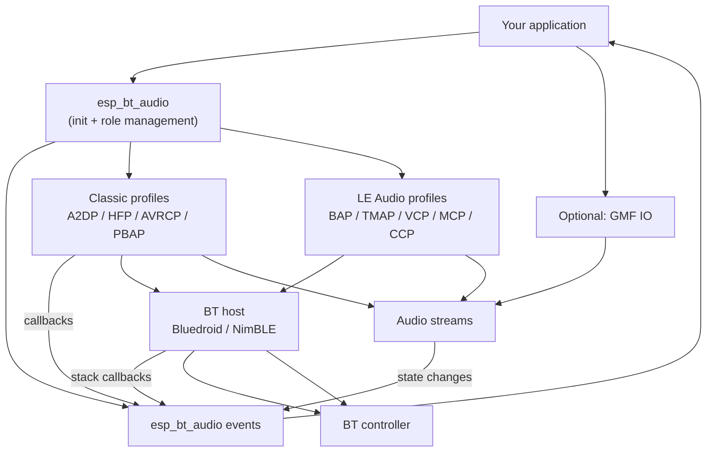
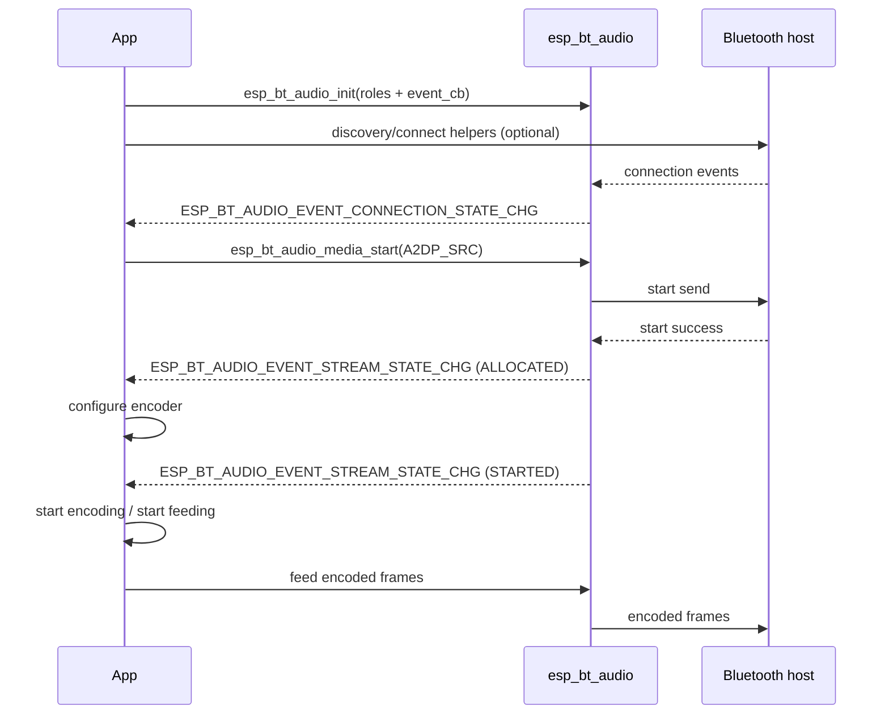
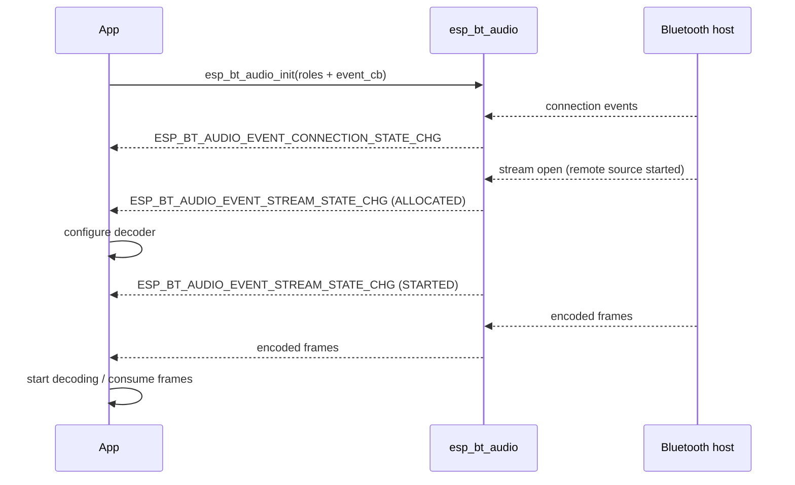
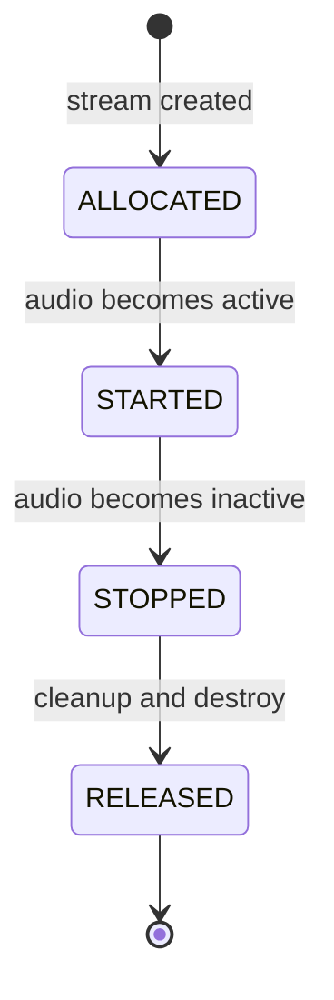
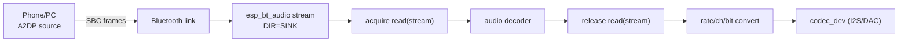

# ESP Bluetooth Audio (`esp_bt_audio`)

- [](https://components.espressif.com/components/espressif/esp_bt_audio)

- [中文](./README_CN.md)

## Overview

`esp_bt_audio` is an advanced Bluetooth audio component from Espressif for unified management of Classic Bluetooth and LE Audio audio capabilities. The component integrates underlying Bluetooth protocols and audio flows, providing unified initialization, data flow, and event notification flows, thus simplifying Bluetooth audio application development. Based on the configured **role**, the component automatically completes initialization and management of the corresponding protocols, and reports connection status, audio stream status, playback control, and other information to the application layer through a unified event mechanism.

In addition, `esp_bt_audio` provides flexible data access methods:
  - **Packet I/O**: directly obtain Bluetooth audio packets; usable from any code
  - **GMF I/O** (`esp_gmf_io_bt`): connect Bluetooth audio streams to ESP-GMF

`esp_bt_audio` significantly reduces development complexity of Bluetooth audio applications while improving application-layer code reusability and extensibility. It is suitable for headphones, speakers, smart devices, and other Bluetooth audio scenarios.

## Features

- **Bluetooth host stack**
  - **Classic audio** requires **Bluedroid** to be enabled (`CONFIG_BT_BLUEDROID_ENABLED`)
  - **LE Audio** requires **NimBLE** with Bluetooth Audio and ISO support (`CONFIG_BT_NIMBLE_ENABLED`, `CONFIG_BT_AUDIO`, `CONFIG_BT_ISO`)
- **Classic Bluetooth profiles**
  - **A2DP Sink**: receive audio from a source (phone/PC) and render locally
  - **A2DP Source**: send local audio to a remote sink (speaker/headset)
  - **HFP Hands-Free (HF)**: conversational audio use cases
  - **AVRCP Controller/Target**: playback control, metadata, notifications
  - **PBAP Client Equipment**: fetch phonebook and call history from the phone
- **LE Audio profiles and roles**
  - **BAP Unicast Server**: expose sink/source ASEs for LE unicast media or conversational audio
  - **BAP Broadcast Source/Sink**: send or receive LC3 broadcast audio streams
  - **Scan Delegator**: accept broadcast assistant requests for broadcast discovery and synchronization
  - **TMAP support**: configure telephony and media role combinations, such as CT, UMR, BMR, and BMS
  - **VCP/MCP/MICP/CCP/CSIP**: volume, media control, microphone, call control, and coordinated-set support
- **Event callback model** (`esp_bt_audio_event_cb_t`)
  - connection/discovery state, device discovery
  - stream allocation/start/stop/release
  - media control commands, playback status/metadata
  - absolute/relative volume events
  - call state and telephony status
  - phonebook and call-history entries
- **Stream abstraction** (`esp_bt_audio_stream_handle_t`)
  - query codec info, direction, context
  - query ISO interval for LE Audio streams (`esp_bt_audio_stream_get_iso_interval`)
  - acquire/release read and write packets
- **Optional ESP-GMF integration**
  - `esp_gmf_io_bt` connects a Bluetooth stream to a GMF pipeline

## Architecture

`esp_bt_audio` acts as an **adapter layer** between the application and the Bluetooth protocol stack: it exposes a unified interface and stream abstraction upward, and integrates with the BT host (Bluedroid / NimBLE) and profiles below, converging underlying callbacks and state into a single event and data interface so the application does not need to deal with per-profile or per-host differences. Classic and LE Audio streams both use the same stream lifecycle and packet I/O model.



## API overview

### Header files

| Header | What it is for |
|--------|----------------|
| `esp_bt_audio.h` | module init/deinit + event callback wiring |
| `esp_bt_audio_event.h` | event IDs and event payload structures |
| `esp_bt_audio_defs.h` | roles (A2DP/HFP/AVRCP), basic enums/defs |
| `esp_bt_audio_host.h` | host configuration structures (Bluedroid/NimBLE) |
| `esp_bt_audio_classic.h` | Classic discovery/connect/scan-mode helpers (Bluedroid) |
| `esp_bt_audio_le.h` | LE Audio scan/connect/disconnect and broadcast sync helpers (NimBLE) |
| `esp_bt_audio_stream.h` | stream abstraction: codec info, direction/context, packet APIs |
| `esp_bt_audio_media.h` | transport control for local media sending (A2DP source) |
| `esp_bt_audio_playback.h` | playback controller commands + metadata/notification helpers |
| `esp_bt_audio_vol.h` | absolute/relative volume control + notifications |
| `esp_bt_audio_tel.h` | telephony: call state, tel status, call control |
| `esp_bt_audio_pb.h` | phonebook and call history |
| `esp_bt_audio_le_playback_sync.h` | optional LE Audio playback start/clock synchronization helpers (`CONFIG_SOC_MODEM_SUPPORT_ETM`) |
| `io/esp_gmf_io_bt.h` | optional GMF I/O adapter (`CONFIG_ESP_BT_AUDIO_GMF_IO_SUPPORT=y`) |

### Event types

`esp_bt_audio_event_cb_t` receives `(event, event_data, user_ctx)`. The type of `event_data` is determined by `event`.

| Event | Payload type (`event_data`) | Typical use |
|-------|-----------------------------|-------------|
| `ESP_BT_AUDIO_EVENT_CONNECTION_STATE_CHG` | `esp_bt_audio_event_connection_st_t` | update connected device / scan policy |
| `ESP_BT_AUDIO_EVENT_DISCOVERY_STATE_CHG` | `esp_bt_audio_event_discovery_st_t` | discovery workflow |
| `ESP_BT_AUDIO_EVENT_DEVICE_DISCOVERED` | `esp_bt_audio_event_device_discovered_t` | list candidates / auto-connect |
| `ESP_BT_AUDIO_EVENT_STREAM_STATE_CHG` | `esp_bt_audio_event_stream_st_t` | bind pipelines, start/stop processing |
| `ESP_BT_AUDIO_EVENT_MEDIA_CTRL_CMD` | `esp_bt_audio_event_media_ctrl_t` | remote play/pause/next/prev |
| `ESP_BT_AUDIO_EVENT_PLAYBACK_STATUS_CHG` | `esp_bt_audio_event_playback_st_t` | play status / position |
| `ESP_BT_AUDIO_EVENT_PLAYBACK_METADATA` | `esp_bt_audio_event_playback_metadata_t` | title/artist/album/etc |
| `ESP_BT_AUDIO_EVENT_VOL_ABSOLUTE` | `esp_bt_audio_event_vol_absolute_t` | apply absolute volume |
| `ESP_BT_AUDIO_EVENT_VOL_RELATIVE` | `esp_bt_audio_event_vol_relative_t` | step volume up/down |
| `ESP_BT_AUDIO_EVENT_CALL_STATE_CHG` | `esp_bt_audio_event_call_state_t` | call state/direction/URI per call index |
| `ESP_BT_AUDIO_EVENT_TEL_STATUS_CHG` | `esp_bt_audio_event_tel_status_chg_t` | battery, signal, roaming, network, operator name |
| `ESP_BT_AUDIO_EVENT_PHONEBOOK_COUNT` | `uint16_t` | total phonebook entry count |
| `ESP_BT_AUDIO_EVENT_PHONEBOOK_ENTRY` | `esp_bt_audio_pb_entry_t` | one phonebook record: names and number list |
| `ESP_BT_AUDIO_EVENT_PHONEBOOK_HISTORY` | `esp_bt_audio_pb_history_t` | one call-history record: contact, type, timestamp |
| `ESP_BT_AUDIO_EVENT_BIG_SYNC_LOST` | none | LE Audio BIG synchronization lost |
| `ESP_BT_AUDIO_EVENT_PA_SYNC_LOST` | none | LE Audio PA synchronization lost |

#### Typical event flow

##### Audio source



##### Audio sink



### Stream types

- **Direction**
  - `ESP_BT_AUDIO_STREAM_DIR_SINK`: downlink (receive). The stream outputs **encoded frames**. Use `acquire_read` / `release_read`.
  - `ESP_BT_AUDIO_STREAM_DIR_SOURCE`: uplink (send). The stream expects **encoded frames**. Use `acquire_write` / `release_write`.
- **Context** (`esp_bt_audio_stream_context_t`)
  - Identifies the use case (e.g. `MEDIA`, `CONVERSATIONAL`) so the application can select an appropriate processing path.
- **Codec info** (`esp_bt_audio_stream_codec_info_t`)
  - Parameters (`codec_type`, `sample_rate`, `channels`, `bits`, `frame_size`, ...) plus `codec_cfg` (type determined by `codec_type`).

#### Stream lifecycle

Stream lifecycle is maintained internally by the component. All state transitions are reported via `ESP_BT_AUDIO_EVENT_STREAM_STATE_CHG`. Use the `state` field (`ALLOCATED` / `STARTED` / `STOPPED` / `RELEASED`) to branch.



Notes:

- **ALLOCATED**: query codec/dir/context, allocate codec resources, and finish required initialization
- **STARTED**: start the encode/decode process (begin processing audio data)
- **STOPPED**: stop the encode/decode process
- **RELEASED**: free resources and finalize cleanup

#### Typical data flows

##### Audio Sink (remote → ESP)



##### Audio Source (ESP → remote)


## Getting started

### Requirements

- **ESP-IDF**: `>= 5.5` (see `idf_component.yml`)

### Integrate into project

If you use the ESP-IDF Component Manager:

```yaml
dependencies:
  espressif/esp_bt_audio:
    version: "^1.0"
```

This component depends on ESP-IDF's `bt` component. When `CONFIG_ESP_BT_AUDIO_GMF_IO_SUPPORT=y`, it also pulls in `gmf_core` and `gmf_io` (see `idf_component.yml`).

### Configuration

#### Enable Classic profiles in ESP-IDF

Classic profile–related source code is compiled only when the corresponding ESP-IDF options are enabled:

- `CONFIG_BT_CLASSIC_ENABLED`
- `CONFIG_BT_A2DP_ENABLE`
- `CONFIG_BT_A2DP_USE_EXTERNAL_CODEC`
- `CONFIG_BT_HFP_ENABLE`
- `CONFIG_BT_HFP_AUDIO_DATA_PATH_HCI`
- `CONFIG_BT_HFP_USE_EXTERNAL_CODEC`
- `CONFIG_BT_AVRCP_ENABLED`
- `CONFIG_BT_PBAC_ENABLED`

#### Enable LE Audio in ESP-IDF

LE Audio support is compiled when NimBLE and ESP-IDF Bluetooth Audio/ISO options are enabled:

- `CONFIG_BT_NIMBLE_ENABLED`
- `CONFIG_BT_AUDIO`
- `CONFIG_BT_ISO`

Optional LE profile switches use ESP-IDF Bluetooth Audio options, including `CONFIG_BT_BAP_UNICAST_SERVER`, `CONFIG_BT_BAP_BROADCAST_SOURCE`, `CONFIG_BT_BAP_BROADCAST_SINK`, `CONFIG_BT_BAP_SCAN_DELEGATOR`, `CONFIG_BT_VCP_VOL_REND`, `CONFIG_BT_MCC`, `CONFIG_BT_MICP_MIC_DEV`, `CONFIG_BT_TBS_CLIENT`, `CONFIG_BT_CSIP_SET_MEMBER`, and `CONFIG_BT_TMAP`.

#### Enable GMF I/O adapter (optional)

`esp_gmf_io_bt` is compiled only when:

- `menuconfig` → `ESP Bluetooth Audio` → `Enable GMF IO Support` (`CONFIG_ESP_BT_AUDIO_GMF_IO_SUPPORT`)

### Initialization

Typical initialization flow:

1. Initialize NVS (Bluetooth uses it)
2. Initialize and enable the BT controller (`esp_bt_controller_init` / `enable`)
3. Prepare host config (`esp_bt_audio_host_bluedroid_cfg_t` for Classic, `esp_bt_audio_host_nimble_cfg_t` for LE Audio)
4. Call `esp_bt_audio_init()` with Classic and/or LE roles plus the event callback

Minimal example skeleton:

```c
#include "esp_bt_audio.h"
#include "esp_bt_audio_host.h"

static void bt_audio_event_cb(esp_bt_audio_event_t event, void *event_data, void *user_data);

void init_bt_audio(void)
{
    esp_bt_audio_host_bluedroid_cfg_t host_cfg = ESP_BT_AUDIO_HOST_BLUEDROID_CFG_DEFAULT();

    esp_bt_audio_config_t cfg = {
        .host_config = &host_cfg,
        .event_cb = bt_audio_event_cb,
        .event_user_ctx = NULL,
        .classic.roles = ESP_BT_AUDIO_CLASSIC_ROLE_A2DP_SNK | ESP_BT_AUDIO_CLASSIC_ROLE_AVRC_TG,
    };

    ESP_ERROR_CHECK(esp_bt_audio_init(&cfg));
}
```

### Event handling

The application registers an event callback (`event_cb`) at init. Connection state, discovery, stream lifecycle, playback control commands, metadata, and volume are all reported through this callback. In the callback, branch on `event`, cast `event_data` to the corresponding type, and handle as needed.

Example skeleton for `bt_audio_event_cb` (implement each case as needed):

```c
static void bt_audio_event_cb(esp_bt_audio_event_t event, void *event_data, void *user_data)
{
    switch (event) {
    case ESP_BT_AUDIO_EVENT_CONNECTION_STATE_CHG: {
        // esp_bt_audio_event_connection_st_t *st = event_data;
        // Update UI/logic or scan policy (connectable/discoverable) from connection state
        break;
    }
    case ESP_BT_AUDIO_EVENT_DISCOVERY_STATE_CHG: {
        // esp_bt_audio_event_discovery_st_t *st = event_data;
        // Discovery started/stopped; drive discovery flow with device list
        break;
    }
    case ESP_BT_AUDIO_EVENT_DEVICE_DISCOVERED: {
        // esp_bt_audio_event_device_discovered_t *dev = event_data;
        // Add device to list or initiate connection per policy
        break;
    }
    case ESP_BT_AUDIO_EVENT_STREAM_STATE_CHG: {
        // esp_bt_audio_event_stream_st_t *st = event_data;
        // For state ALLOCATED/STARTED/STOPPED/RELEASED: configure codec, bind GMF IO, start/stop data I/O
        break;
    }
    case ESP_BT_AUDIO_EVENT_MEDIA_CTRL_CMD: {
        // esp_bt_audio_event_media_ctrl_t *cmd = event_data;
        // Handle remote media control commands (play/pause/previous/next etc.)
        break;
    }
    case ESP_BT_AUDIO_EVENT_PLAYBACK_STATUS_CHG: {
        // esp_bt_audio_event_playback_st_t *st = event_data;
        // Update playback status and position
        break;
    }
    case ESP_BT_AUDIO_EVENT_PLAYBACK_METADATA: {
        // esp_bt_audio_event_playback_metadata_t *meta = event_data;
        // Show title, artist, album etc.
        break;
    }
    case ESP_BT_AUDIO_EVENT_VOL_ABSOLUTE: {
        // esp_bt_audio_event_vol_absolute_t *vol = event_data;
        // Apply absolute volume (sync to local output)
        break;
    }
    case ESP_BT_AUDIO_EVENT_VOL_RELATIVE: {
        // esp_bt_audio_event_vol_relative_t *vol = event_data;
        // Handle volume step (up/down)
        break;
    }
    case ESP_BT_AUDIO_EVENT_CALL_STATE_CHG: {
        // esp_bt_audio_event_call_state_t *call = event_data;
        // Update call list (idx, dir, state, uri); answer/reject via esp_bt_audio_call_*()
        break;
    }
    case ESP_BT_AUDIO_EVENT_TEL_STATUS_CHG: {
        // esp_bt_audio_event_tel_status_chg_t *tel = event_data;
        // Handle tel status (type + data: battery, signal_strength, roaming, network, operator_name)
        break;
    }
    case ESP_BT_AUDIO_EVENT_PHONEBOOK_COUNT: {
        // uint16_t count = *(uint16_t *)event_data;
        // Total entry count for the phone book
        break;
    }
    case ESP_BT_AUDIO_EVENT_PHONEBOOK_ENTRY: {
        // esp_bt_audio_pb_entry_t *entry = event_data;
        // Parse fullname, name fields, and tel[] (type + number, up to ESP_BT_AUDIO_PB_TEL_LIST_MAX)
        break;
    }
    case ESP_BT_AUDIO_EVENT_PHONEBOOK_HISTORY: {
        // esp_bt_audio_pb_history_t *history = event_data;
        // Call log: entry, property (e.g. RECEIVED/DIALED/MISSED), timestamp (e.g. YYYYMMDDTHHMMSSZ)
        break;
    }
    case ESP_BT_AUDIO_EVENT_BIG_SYNC_LOST: {
        // LE Audio BIG synchronization was lost; restart broadcast discovery/sync as needed
        break;
    }
    case ESP_BT_AUDIO_EVENT_PA_SYNC_LOST: {
        // LE Audio PA synchronization was lost; restart PA sync as needed
        break;
    }
    default:
        break;
    }
}
```

### GMF IO overview

When `CONFIG_ESP_BT_AUDIO_GMF_IO_SUPPORT=y`, the component provides `esp_gmf_io_bt`, which adapts a Bluetooth audio stream to GMF I/O so it can be used in a GMF pipeline.

#### Implementation layer

- **ESP-GMF** (Espressif General Multimedia Framework) is a lightweight framework for IoT multimedia. For more, see the [README](https://github.com/espressif/esp-gmf/blob/main/README.md).
- In **GMF-Core**, a pipeline’s input (IN) and output (OUT) are represented by **GMF-IO**, with a unified data interface: `acquire_read` / `release_read`, `acquire_write` / `release_write`.
- **esp_gmf_io_bt** is one GMF-IO implementation; it feeds the Bluetooth stream into GMF's DataBus and chains it with other GMF elements (decoder, encoder, resampler, etc.).


#### Usage

1. **Register and create**: Register `io_bt` in the GMF pool as reader and/or writer; `stream` may be `NULL` at init.
2. **Bind stream**: In the event callback, on `ESP_BT_AUDIO_EVENT_STREAM_STATE_CHG` with `state == ESP_BT_AUDIO_STREAM_STATE_ALLOCATED`, call `esp_gmf_io_bt_set_stream(io_handle, stream_handle)` so the current Bluetooth stream is bound to the pipeline’s IN or OUT, according to stream direction.
3. **Direction mapping**: Bluetooth **sink** stream (receive) → pipeline **IN**, use `io_bt` **reader**; Bluetooth **source** stream (send) → pipeline **OUT**, use `io_bt` **writer**.
4. **Run/stop**: On stream STARTED/STOPPED (and similar) events, run or stop the pipeline that is bound to that stream.

#### Typical pipeline combinations

- **A2DP Sink (remote → local playback)**: `io_bt` (reader) → decoder (aud_dec) → resample/channel convert (aud_rate_cvt, aud_ch_cvt) → `io_codec_dev` (writer, I2S/speaker).

```c
const char *el[] = {"aud_dec", "aud_rate_cvt", "aud_ch_cvt"};
esp_gmf_pool_new_pipeline(pool, "io_bt", el, sizeof(el) / sizeof(char *), "io_codec_dev", &sink_pipe);
```

- **A2DP Source (local → remote)**: `io_file` or `io_codec_dev` (reader) → decoder (if needed) → encoder (aud_enc) → `io_bt` (writer).

```c
const char *el[] = {"aud_dec", "aud_rate_cvt", "aud_ch_cvt", "aud_enc"};
esp_gmf_pool_new_pipeline(pool, "io_file", el, sizeof(el) / sizeof(char *), "io_bt", &source_pipe);
```

### Telephony (`esp_bt_audio_tel.h`)

`esp_bt_audio_tel.h` provides event reporting for call state and telephony status, plus call control APIs.

- **Call control**: answer (`esp_bt_audio_call_answer`), reject/hang up (`esp_bt_audio_call_reject`), dial (`esp_bt_audio_call_dial`).
- **Call state**: delivered via `ESP_BT_AUDIO_EVENT_CALL_STATE_CHG`; covers incoming, dialing, active, held, etc.
- **Telephony status**: delivered via `ESP_BT_AUDIO_EVENT_TEL_STATUS_CHG`; covers battery, signal, roaming, network, operator name, etc.

### Phonebook and call history

- **Connection**: This feature uses Classic Bluetooth. After the phone is paired, call `esp_bt_audio_classic_connect(ESP_BT_AUDIO_CLASSIC_ROLE_PBAP_PCE, addr)` with the peer address to establish the session.
- **Fetch**: Call `esp_bt_audio_pb_fetch()` to retrieve part or all of the phonebook and call history.

### Classic helper APIs

When Classic + Bluedroid are enabled, `esp_bt_audio_classic.h` provides helper operations such as:

- discovery start/stop
- connect/disconnect by role + device address
- set scan mode (connectable/discoverable)

### LE Audio helper APIs

When LE Audio + NimBLE are enabled, `esp_bt_audio_le.h` provides helper operations such as:

- start/stop LE scan (`esp_bt_audio_le_scan_start`, `esp_bt_audio_le_scan_stop`)
- connect/disconnect LE ACL links (`esp_bt_audio_le_connect`, `esp_bt_audio_le_disconnect`)
- synchronize to or terminate synchronization with broadcast audio (`esp_bt_audio_le_broadcast_sync`, `esp_bt_audio_le_pa_sync_terminate`)

## Usage

For example code, refer to the [examples](./examples) folder for Bluetooth audio playback and sending demos.

You can also create a project using the following commands, taking the `bt_audio` project as an example. Before starting, make sure you have a working [ESP-IDF](https://docs.espressif.com/projects/esp-idf/en/latest/esp32/get-started/index.html) environment.

### Create the Example Project

Create the `bt_audio` example project based on the `esp_bt_audio` component (using version v0.8.0 as an example; update the version as needed):

```shell
idf.py create-project-from-example "espressif/esp_bt_audio=0.8.0:bt_audio"
```
