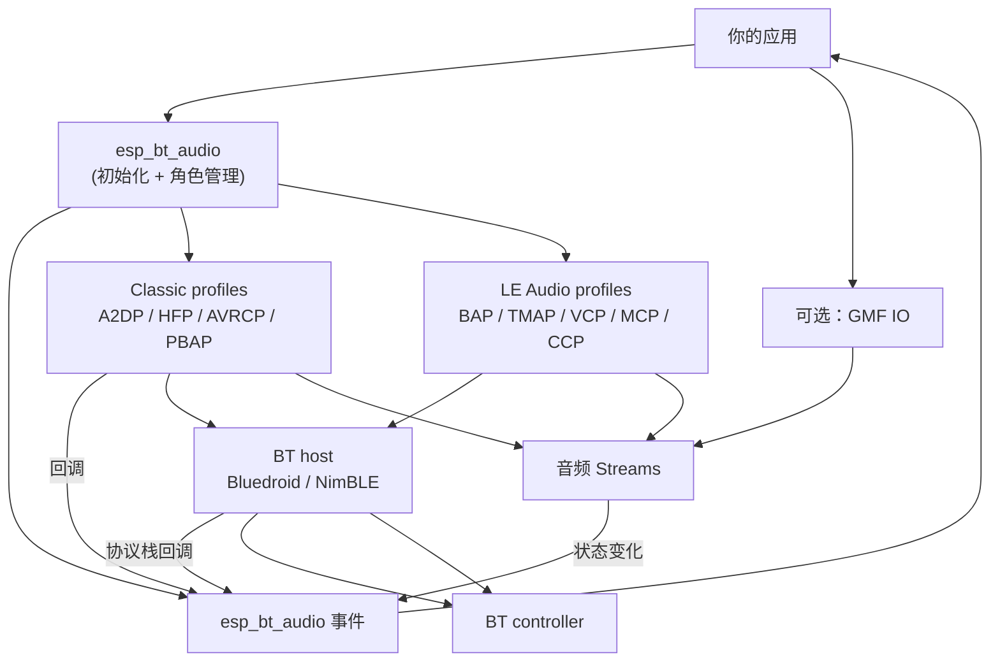
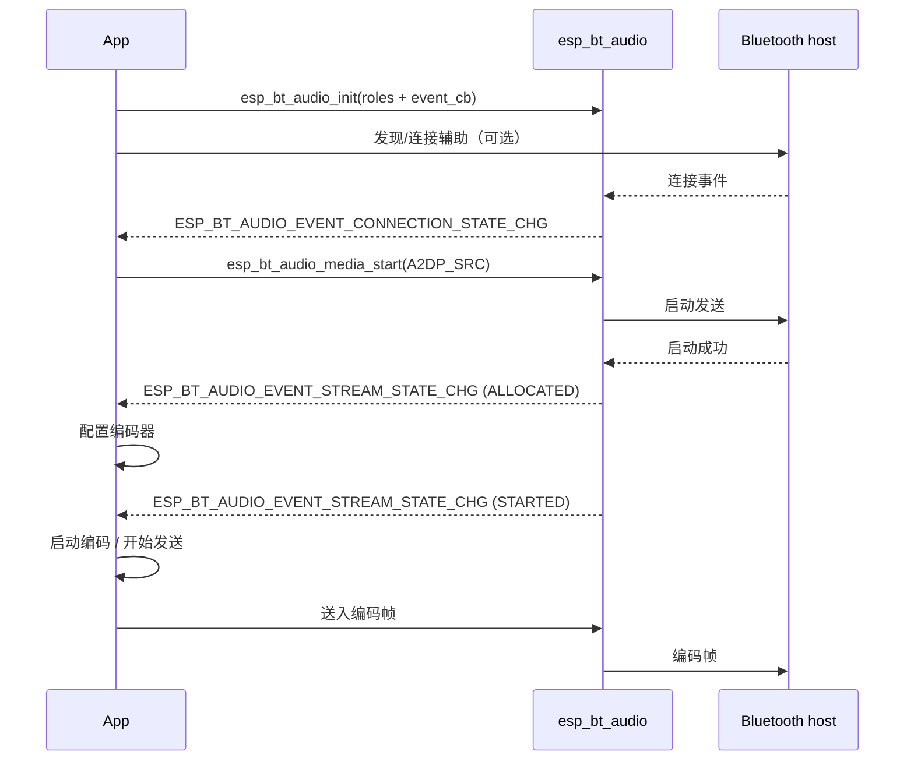
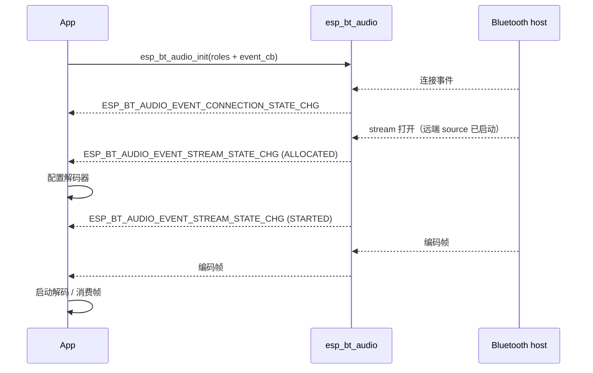
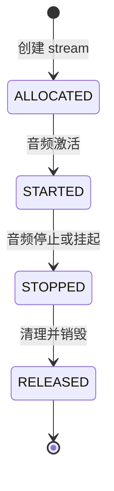
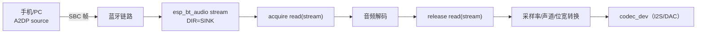
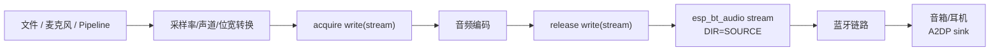

# ESP Bluetooth Audio（`esp_bt_audio`）

- [](https://components.espressif.com/components/espressif/esp_bt_audio)

- [English](./README.md)

## 概述

`esp_bt_audio` 是乐鑫提供的蓝牙音频高级组件，用于统一管理经典蓝牙（Classic Bluetooth）与 LE Audio 的音频能力。该组件对底层蓝牙协议与音频流程进行了整合，提供统一初始化、数据流、事件通知流程，从而简化蓝牙音频应用的开发。组件根据配置的角色（role）自动完成相应协议的初始化与管理，并通过统一的事件机制向应用层上报连接状态、音频流状态以及播放控制等信息。

此外，`esp_bt_audio` 提供灵活的数据接入方式：
  - 支持 Packet I/O 方式直接获取蓝牙音频数据包，任意代码可用
  - 支持 GMF I/O (esp_gmf_io_bt) 将蓝牙音频流接入 ESP-GMF

`esp_bt_audio` 能够显著降低蓝牙音频应用的开发复杂度，同时提高应用层代码的复用性与可扩展性，适用于耳机、音箱、智能设备等多种蓝牙音频场景。

## 特性

- **Bluetooth host 协议栈**
  - **Classic 音频**需使能**Bluedroid**（`CONFIG_BT_BLUEDROID_ENABLED`）
  - **LE Audio** 需使能 **NimBLE** 以及 Bluetooth Audio / ISO 支持（`CONFIG_BT_NIMBLE_ENABLED`、`CONFIG_BT_AUDIO`、`CONFIG_BT_ISO`）
- **Classic 蓝牙协议**
  - **A2DP Sink**：从音源（手机/PC）接收音频并在本地播放
  - **A2DP Source**：将本地音频发送到远端音箱/耳机
  - **HFP Hands-Free (HF)**：通话等语音场景
  - **AVRCP Controller/Target**：播放控制、元数据、通知
  - **PBAP Client Equipment**：拉取手机通讯录与通话记录
- **LE Audio 协议与角色**
  - **BAP Unicast Server**：暴露 sink/source ASE，用于 LE 单播媒体或通话音频
  - **BAP Broadcast Source/Sink**：发送或接收 LC3 广播音频流
  - **Scan Delegator**：接收 Broadcast Assistant 的广播发现与同步请求
  - **TMAP 支持**：配置 CT、UMR、BMR、BMS 等电话与媒体角色组合
  - **VCP/MCP/MICP/CCP/CSIP**：支持音量、媒体控制、麦克风、通话控制与协同组能力
- **事件回调模型**（`esp_bt_audio_event_cb_t`）
  - 连接/发现状态、设备发现
  - stream 分配/启动/停止/释放
  - 媒体控制命令、播放状态/元数据
  - 绝对/相对音量事件
  - 通话状态与电话状态
  - 通讯录、通话记录条目
- **Stream 抽象**（`esp_bt_audio_stream_handle_t`）
  - 查询 codec 信息、方向、上下文
  - 查询 LE Audio stream 的 ISO 间隔（`esp_bt_audio_stream_get_iso_interval`）
  - 获取/释放读、写数据包
- **可选 ESP-GMF 集成**
  - `esp_gmf_io_bt` 将蓝牙 stream 接入 GMF pipeline

## 架构

`esp_bt_audio` 作为**适配层**介于应用与蓝牙协议栈之间：对上提供统一接口和 stream 抽象，对下对接 BT host（Bluedroid / NimBLE）及协议，将底层回调与状态收敛为单一事件与数据接口，应用无需关心各 profile / host 差异。Classic 与 LE Audio stream 使用相同的生命周期与 packet I/O 模型。



## API 概览

### 头文件分类

| 头文件 | 用途 |
|--------|------|
| `esp_bt_audio.h` | 模块 init/deinit + 事件回调对接 |
| `esp_bt_audio_event.h` | 事件枚举与事件数据结构 |
| `esp_bt_audio_defs.h` | roles（A2DP/HFP/AVRCP）与基础定义 |
| `esp_bt_audio_host.h` | host 配置结构（Bluedroid/NimBLE） |
| `esp_bt_audio_classic.h` | Classic discovery/connect/scan-mode 辅助接口（Bluedroid） |
| `esp_bt_audio_le.h` | LE Audio 扫描、连接、断开与广播同步辅助接口（NimBLE） |
| `esp_bt_audio_stream.h` | stream 抽象：codec/方向/context + packet API |
| `esp_bt_audio_media.h` | 本地媒体推送的传输控制（A2DP source） |
| `esp_bt_audio_playback.h` | 播放控制命令 + 元数据/通知注册 |
| `esp_bt_audio_vol.h` | 绝对/相对音量控制 + 通知 |
| `esp_bt_audio_tel.h` | 电话：通话状态、电话状态，通话控制 |
| `esp_bt_audio_pb.h` | 通讯录，通话记录 |
| `esp_bt_audio_le_playback_sync.h` | 可选 LE Audio 播放启动/时钟同步辅助接口（`CONFIG_SOC_MODEM_SUPPORT_ETM`） |
| `io/esp_gmf_io_bt.h` | 可选 GMF I/O 适配（`CONFIG_ESP_BT_AUDIO_GMF_IO_SUPPORT=y`） |

### 事件类型

`esp_bt_audio_event_cb_t` 接收 `(event, event_data, user_ctx)`。`event_data` 的具体类型由 `event` 决定。

| 事件 | `event_data` 数据类型 | 常见用途 |
|------|------------------------|----------|
| `ESP_BT_AUDIO_EVENT_CONNECTION_STATE_CHG` | `esp_bt_audio_event_connection_st_t` | 连接状态/scan 策略 |
| `ESP_BT_AUDIO_EVENT_DISCOVERY_STATE_CHG` | `esp_bt_audio_event_discovery_st_t` | 扫描流程 |
| `ESP_BT_AUDIO_EVENT_DEVICE_DISCOVERED` | `esp_bt_audio_event_device_discovered_t` | 设备列表/自动连接 |
| `ESP_BT_AUDIO_EVENT_STREAM_STATE_CHG` | `esp_bt_audio_event_stream_st_t` | pipeline 绑定与启停 |
| `ESP_BT_AUDIO_EVENT_MEDIA_CTRL_CMD` | `esp_bt_audio_event_media_ctrl_t` | 远端播控命令处理 |
| `ESP_BT_AUDIO_EVENT_PLAYBACK_STATUS_CHG` | `esp_bt_audio_event_playback_st_t` | 播放状态/进度 |
| `ESP_BT_AUDIO_EVENT_PLAYBACK_METADATA` | `esp_bt_audio_event_playback_metadata_t` | 标题/歌手/专辑等 |
| `ESP_BT_AUDIO_EVENT_VOL_ABSOLUTE` | `esp_bt_audio_event_vol_absolute_t` | 应用绝对音量 |
| `ESP_BT_AUDIO_EVENT_VOL_RELATIVE` | `esp_bt_audio_event_vol_relative_t` | 音量步进加减 |
| `ESP_BT_AUDIO_EVENT_CALL_STATE_CHG` | `esp_bt_audio_event_call_state_t` | 通话状态/方向/号码（按 call index） |
| `ESP_BT_AUDIO_EVENT_TEL_STATUS_CHG` | `esp_bt_audio_event_tel_status_chg_t` | 电量、信号、漫游、网络、运营商名称 |
| `ESP_BT_AUDIO_EVENT_PHONEBOOK_COUNT` | `uint16_t` | 通讯录条目总数 |
| `ESP_BT_AUDIO_EVENT_PHONEBOOK_ENTRY` | `esp_bt_audio_pb_entry_t` | 单条通讯录：姓名、号码列表等 |
| `ESP_BT_AUDIO_EVENT_PHONEBOOK_HISTORY` | `esp_bt_audio_pb_history_t` | 单条通话记录：联系人、类型、时间戳等 |
| `ESP_BT_AUDIO_EVENT_BIG_SYNC_LOST` | 无 | LE Audio BIG 同步丢失 |
| `ESP_BT_AUDIO_EVENT_PA_SYNC_LOST` | 无 | LE Audio PA 同步丢失 |

#### 典型事件流程

##### 音频源（Audio source）



##### 音频接收（Audio sink）



### Stream 类型

- **Stream 方向**
  - `ESP_BT_AUDIO_STREAM_DIR_SINK`：下行（接收）方向。stream 向应用侧输出**编码帧**，使用 `acquire_read` / `release_read`
  - `ESP_BT_AUDIO_STREAM_DIR_SOURCE`：上行（发送）方向。stream 期望应用侧写入**编码帧**，使用 `acquire_write` / `release_write`
- **Stream 上下文**（`esp_bt_audio_stream_context_t`）
  - 标识业务场景（例如 `MEDIA`、`CONVERSATIONAL`），便于选择数据路径与处理策略
- **Codec 信息**（`esp_bt_audio_stream_codec_info_t`）
  - 参数（`codec_type`、`sample_rate`、`channels`、`bits`、`frame_size` 等）以及 `codec_cfg`（结构类型由 `codec_type` 决定）

#### Stream 生命周期

stream 的生命周期由模块内部维护，所有状态变化都通过 `ESP_BT_AUDIO_EVENT_STREAM_STATE_CHG` 上报。根据 `state` 字段（`ALLOCATED` / `STARTED` / `STOPPED` / `RELEASED`）分支处理。



说明：

- **ALLOCATED**：读取 codec/dir/context，分配编解码资源并完成必要的初始化配置
- **STARTED**：开启编码/解码过程（开始处理音频数据）
- **STOPPED**：停止编码/解码过程
- **RELEASED**：释放资源并完成清理

#### 典型数据流

##### Audio Sink（远端 → ESP）



##### Audio Source（ESP → 远端）



## 快速开始

### 环境要求

- **ESP-IDF**：`>= 5.5`（见 `idf_component.yml`）

### 集成到工程

若使用 ESP-IDF Component Manager：

```yaml
dependencies:
  espressif/esp_bt_audio:
    version: "^1.0"
```

该组件依赖 ESP-IDF 的 `bt` 组件；当 `CONFIG_ESP_BT_AUDIO_GMF_IO_SUPPORT=y` 时，还会引入 `gmf_core` 与 `gmf_io`（见 `idf_component.yml`）。

### 配置

#### 在 ESP-IDF 中开启 Classic profiles

Classic profile 相关源码只有在对应 ESP-IDF 配置打开时才会参与编译：

- `CONFIG_BT_CLASSIC_ENABLED`
- `CONFIG_BT_A2DP_ENABLE`
- `CONFIG_BT_A2DP_USE_EXTERNAL_CODEC`
- `CONFIG_BT_HFP_ENABLE`
- `CONFIG_BT_HFP_AUDIO_DATA_PATH_HCI`
- `CONFIG_BT_HFP_USE_EXTERNAL_CODEC`
- `CONFIG_BT_AVRCP_ENABLED`
- `CONFIG_BT_PBAC_ENABLED`

#### 在 ESP-IDF 中开启 LE Audio

LE Audio 相关源码会在 NimBLE 以及 ESP-IDF Bluetooth Audio / ISO 选项打开后参与编译：

- `CONFIG_BT_NIMBLE_ENABLED`
- `CONFIG_BT_AUDIO`
- `CONFIG_BT_ISO`

可选 LE profile 开关使用 ESP-IDF Bluetooth Audio 配置，包括 `CONFIG_BT_BAP_UNICAST_SERVER`、`CONFIG_BT_BAP_BROADCAST_SOURCE`、`CONFIG_BT_BAP_BROADCAST_SINK`、`CONFIG_BT_BAP_SCAN_DELEGATOR`、`CONFIG_BT_VCP_VOL_REND`、`CONFIG_BT_MCC`、`CONFIG_BT_MICP_MIC_DEV`、`CONFIG_BT_TBS_CLIENT`、`CONFIG_BT_CSIP_SET_MEMBER` 与 `CONFIG_BT_TMAP`。

#### 开启 GMF I/O 适配层（可选）

只有在以下配置打开时，才会编译 `esp_gmf_io_bt`：

- `menuconfig` → `ESP Bluetooth Audio` → `Enable GMF IO Support`（`CONFIG_ESP_BT_AUDIO_GMF_IO_SUPPORT`）

### 初始化

典型初始化流程：

1. 初始化 NVS（Bluetooth 会用到）
2. 初始化并使能 BT controller（`esp_bt_controller_init` / `enable`）
3. 准备 host 配置（Classic 使用 `esp_bt_audio_host_bluedroid_cfg_t`，LE Audio 使用 `esp_bt_audio_host_nimble_cfg_t`）
4. 指定 Classic 和/或 LE roles + event callback，调用 `esp_bt_audio_init()`

最小示例骨架：

```c
#include "esp_bt_audio.h"
#include "esp_bt_audio_host.h"

static void bt_audio_event_cb(esp_bt_audio_event_t event, void *event_data, void *user_data);

void init_bt_audio(void)
{
    esp_bt_audio_host_bluedroid_cfg_t host_cfg = ESP_BT_AUDIO_HOST_BLUEDROID_CFG_DEFAULT();

    esp_bt_audio_config_t cfg = {
        .host_config = &host_cfg,
        .event_cb = bt_audio_event_cb,
        .event_user_ctx = NULL,
        .classic.roles = ESP_BT_AUDIO_CLASSIC_ROLE_A2DP_SNK | ESP_BT_AUDIO_CLASSIC_ROLE_AVRC_TG,
    };

    ESP_ERROR_CHECK(esp_bt_audio_init(&cfg));
}
```

### 事件处理

应用在初始化时注册事件回调（`event_cb`），连接状态、发现、stream 生命周期、播控命令、元数据与音量等均由该回调上报。在回调中根据 `event` 分支，将 `event_data` 转为对应类型后处理。

`bt_audio_event_cb` 框架示例（按需实现各 case）：

```c
static void bt_audio_event_cb(esp_bt_audio_event_t event, void *event_data, void *user_data)
{
    switch (event) {
    case ESP_BT_AUDIO_EVENT_CONNECTION_STATE_CHG: {
        // esp_bt_audio_event_connection_st_t *st = event_data;
        // 根据连接状态更新 UI/逻辑，或调整 scan 策略（可连接/可发现）
        break;
    }
    case ESP_BT_AUDIO_EVENT_DISCOVERY_STATE_CHG: {
        // esp_bt_audio_event_discovery_st_t *st = event_data;
        // 扫描开始/结束，可配合设备列表做发现流程控制
        break;
    }
    case ESP_BT_AUDIO_EVENT_DEVICE_DISCOVERED: {
        // esp_bt_audio_event_device_discovered_t *dev = event_data;
        // 将设备加入列表，或按策略发起连接
        break;
    }
    case ESP_BT_AUDIO_EVENT_STREAM_STATE_CHG: {
        // esp_bt_audio_event_stream_st_t *st = event_data;
        // 按 state（ALLOCATED/STARTED/STOPPED/RELEASED）配置编解码、绑定 GMF IO、启停数据读写
        break;
    }
    case ESP_BT_AUDIO_EVENT_MEDIA_CTRL_CMD: {
        // esp_bt_audio_event_media_ctrl_t *cmd = event_data;
        // 处理远端播控指令（播放/暂停/上一曲/下一曲等）
        break;
    }
    case ESP_BT_AUDIO_EVENT_PLAYBACK_STATUS_CHG: {
        // esp_bt_audio_event_playback_st_t *st = event_data;
        // 更新播放状态与进度
        break;
    }
    case ESP_BT_AUDIO_EVENT_PLAYBACK_METADATA: {
        // esp_bt_audio_event_playback_metadata_t *meta = event_data;
        // 展示标题、歌手、专辑等元数据
        break;
    }
    case ESP_BT_AUDIO_EVENT_VOL_ABSOLUTE: {
        // esp_bt_audio_event_vol_absolute_t *vol = event_data;
        // 应用绝对音量（同步到本地输出）
        break;
    }
    case ESP_BT_AUDIO_EVENT_VOL_RELATIVE: {
        // esp_bt_audio_event_vol_relative_t *vol = event_data;
        // 处理音量步进（增/减）
        break;
    }
    case ESP_BT_AUDIO_EVENT_CALL_STATE_CHG: {
        // esp_bt_audio_event_call_state_t *call = event_data;
        // 更新通话列表（idx、dir、state、uri）；通过 esp_bt_audio_call_*() 接听/拒接
        break;
    }
    case ESP_BT_AUDIO_EVENT_TEL_STATUS_CHG: {
        // esp_bt_audio_event_tel_status_chg_t *tel = event_data;
        // 处理电话状态（type + data：battery、signal_strength、roaming、network、operator_name）
        break;
    }
    case ESP_BT_AUDIO_EVENT_PHONEBOOK_COUNT: {
        // uint16_t count = *(uint16_t *)event_data;
        // 通讯录条目总数
        break;
    }
    case ESP_BT_AUDIO_EVENT_PHONEBOOK_ENTRY: {
        // esp_bt_audio_pb_entry_t *entry = event_data;
        // 解析 fullname、name（姓/名/中间名等）与 tel[]（类型 + 号码，最多 ESP_BT_AUDIO_PB_TEL_LIST_MAX 条）
        break;
    }
    case ESP_BT_AUDIO_EVENT_PHONEBOOK_HISTORY: {
        // esp_bt_audio_pb_history_t *history = event_data;
        // 通话记录：entry、property（如 RECEIVED/DIALED/MISSED）、timestamp（如 YYYYMMDDTHHMMSSZ）
        break;
    }
    case ESP_BT_AUDIO_EVENT_BIG_SYNC_LOST: {
        // LE Audio BIG 同步丢失；可按需重新执行广播发现/同步流程
        break;
    }
    case ESP_BT_AUDIO_EVENT_PA_SYNC_LOST: {
        // LE Audio PA 同步丢失；可按需重新执行 PA 同步流程
        break;
    }
    default:
        break;
    }
}
```

### GMF IO 介绍

当 `CONFIG_ESP_BT_AUDIO_GMF_IO_SUPPORT=y` 时，组件提供 `esp_gmf_io_bt`，将蓝牙音频 stream 适配为 GMF 的 I/O，从而接入 GMF pipeline。

#### 实现层级

- **ESP-GMF**（Espressif General Multimedia Framework）是面向 IoT 多媒体场景的轻量级框架。更多说明见 [README](https://github.com/espressif/esp-gmf/blob/main/README.md)。
- **GMF-Core** 中，Pipeline 的输入端（IN）和输出端（OUT）由 **GMF-IO** 抽象表示，提供 `acquire_read` / `release_read`、`acquire_write` / `release_write` 等统一数据接口。
- **esp_gmf_io_bt** 是 GMF-IO 的一种实现，将蓝牙 stream 的数据接入 GMF 的 DataBus，与其它 GMF Element（解码、编码、重采样等）串联。

#### 使用逻辑

1. **注册与创建**：在 GMF Pool 中按方向注册 `io_bt`（reader 和/或 writer），初始化时 `stream` 可填 `NULL`。
2. **绑定 stream**：在事件回调中收到 `ESP_BT_AUDIO_EVENT_STREAM_STATE_CHG` 且 `state == ESP_BT_AUDIO_STREAM_STATE_ALLOCATED` 时，根据 stream 方向调用 `esp_gmf_io_bt_set_stream(io_handle, stream_handle)`，将当前蓝牙 stream 绑定到对应 pipeline 的 IN 或 OUT。
3. **方向对应**：Bluetooth **sink** stream（下行，接收）→ 作为 pipeline 的 **IN**，使用 `io_bt` 的 **reader**；Bluetooth **source** stream（上行，发送）→ 作为 pipeline 的 **OUT**，使用 `io_bt` 的 **writer**。
4. **启停**：在 stream 的 STARTED/STOPPED 等状态变化时，对已绑定该 stream 的 pipeline 执行 run/stop 等控制。

#### 典型 pipeline 组合

- **A2DP Sink（远端 → 本机播放）**：`io_bt`(reader) → 解码(aud_dec) → 重采样/声道转换(aud_rate_cvt, aud_ch_cvt) → `io_codec_dev`(writer，I2S/扬声器)。

```c
const char *el[] = {"aud_dec", "aud_rate_cvt", "aud_ch_cvt"};
esp_gmf_pool_new_pipeline(pool, "io_bt", el, sizeof(el) / sizeof(char *), "io_codec_dev", &sink_pipe);
```

- **A2DP Source（本机 → 远端）**：`io_file` 或 `io_codec_dev`(reader) → 解码(若需要) → 编码(aud_enc) → `io_bt`(writer)。

```c
const char *el[] = {"aud_dec", "aud_rate_cvt", "aud_ch_cvt", "aud_enc"};
esp_gmf_pool_new_pipeline(pool, "io_file", el, sizeof(el) / sizeof(char *), "io_bt", &source_pipe);
```

### 电话辅助接口

`esp_bt_audio_tel.h` 提供通话状态与电话状态的事件上报，以及通话控制 API。

- **通话控制**：接听（`esp_bt_audio_call_answer`）、拒接/挂断（`esp_bt_audio_call_reject`）、拨号（`esp_bt_audio_call_dial`）。
- **通话状态**：通过 `ESP_BT_AUDIO_EVENT_CALL_STATE_CHG` 获取，包括来电、拨号中、接通、保持等。
- **电话状态**：通过 `ESP_BT_AUDIO_EVENT_TEL_STATUS_CHG` 获取，包括电量、信号、漫游、网络、运营商名称等。

### 通讯录与通话记录

- **连接**：经典蓝牙使用此功能，需要在手机已配对的前提下，对目标设备地址调用 `esp_bt_audio_classic_connect(ESP_BT_AUDIO_CLASSIC_ROLE_PBAP_PCE, addr)` 建立会话
- **拉取**：调用 `esp_bt_audio_pb_fetch`拉取部分或者全部的通讯录，通话记录

### Classic 辅助接口

当启用 Classic + Bluedroid 时，`esp_bt_audio_classic.h` 提供常用辅助操作，例如：

- discovery start/stop
- 按 role + 设备地址 connect/disconnect
- 设置 scan mode（connectable/discoverable）

### LE Audio 辅助接口

当启用 LE Audio + NimBLE 时，`esp_bt_audio_le.h` 提供常用辅助操作，例如：

- 启停 LE scan（`esp_bt_audio_le_scan_start`、`esp_bt_audio_le_scan_stop`）
- 连接/断开 LE ACL 链路（`esp_bt_audio_le_connect`、`esp_bt_audio_le_disconnect`）
- 同步或终止同步广播音频（`esp_bt_audio_le_broadcast_sync`、`esp_bt_audio_le_pa_sync_terminate`）

## 示例

示例代码，请参阅 [示例](./examples) 文件夹中的蓝牙音频播放与发送程序。

此外，也可通过以下命令创建工程，以 `bt_audio` 示例工程为例。开始之前需要有可运行的 [ESP-IDF](https://docs.espressif.com/projects/esp-idf/en/latest/esp32/get-started/index.html) 环境。

### 创建示例工程

基于 `esp_bt_audio` 组件创建 `bt_audio` 的示例（以 v0.8.0 版本为例， 请根据实际使用更新版本参数）

``` shell
idf.py create-project-from-example "espressif/esp_bt_audio=0.8.0:bt_audio"
```
